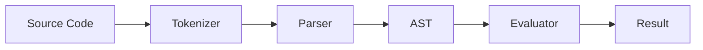

# Getting Started


Welcome to Lits — a pure functional programming language that runs in JavaScript. Every piece of syntax produces a value (there are no statements), all data is immutable, and functions are first-class values.

## Expressions

Everything in Lits is an expression that evaluates to a value. Lits uses algebraic notation, so you can write math naturally:

```
10 + 20
```

Operators require whitespace around them. `x+1` is a variable name, not `x + 1`.

## Variables

Use `let` to bind values to names. Variables are immutable — once bound, they cannot be reassigned:

```
let greeting = "World";
str("Hello, ", greeting, "!")
```

Semicolons separate expressions. The last expression is the return value — no trailing semicolon needed.

## Functions

Define functions with the arrow (`->`) syntax:

```
let square = x -> x * x;
square(5)
```

## Collections

Arrays and objects are the primary data structures. Use functions like `map`, `filter`, and `reduce` to work with them:

```
let numbers = [1, 2, 3, 4, 5];
reduce(numbers, +, 0)
```

## Control Flow

Use `if` / `then` / `else` / `end` for conditional expressions. Since everything is an expression, `if` returns a value:

```
if 10 > 5 then "big" else "small" end
```

## Immutability

Data in Lits is always immutable. Operations return new values rather than modifying existing ones:

```
let original = [1, 2, 3];
let extended = push(original, 4);
original
```

The original array is unchanged. `push` returned a new array.

## How Lits Works


